# Kalshi Advanced Quantitative Trading Bot


### *Institutional-grade event-market automation — now accessible to everyone.*

> ⭐ **Like this project to unlock the *Beta Tester Script* and get early access to new strategy modules!**
> Your support directly helps expand features, add new strategies, and continue public development.

---

## 🌟 Overview

The **Kalshi Advanced Quantitative Trading Bot** is an enterprise-level automated trading system designed specifically for Kalshi's event-based markets.
It combines **AI-driven signal models**, **quantitative strategies**, and **multi-layer risk management** into a clean Telegram-controlled experience suitable for both retail traders and professional quants.

---

## ✨ Why This Bot Stands Out

* 🧠 **AI-enhanced signal generation**
* 📉 **Statistical arbitrage & regime-based trading**
* 🛡️ **Institutional risk management (Kelly, VaR, MDD limits)**
* 📲 **Fully controllable via Telegram**
* ⚙️ **Zero technical setup required once deployed**

---

## 🧠 Core Strategy Modules (Short Version)

### **1. News & Sentiment Engine**

* Real-time NLP on news + social sentiment
* Confidence-weighted sentiment scoring
* Event correlation mapping

### **2. Statistical Arbitrage**

* Cointegration detection
* Z-score mean reversion
* Multi-market pair trading

### **3. Volatility Trading**

* GARCH(1,1) volatility forecasting
* Regime detection (low/normal/high vol)
* Volatility-based sizing + hedging

---

## 🛡️ Risk Management Layer

* Kelly Criterion (Half-Kelly implementation)
* Trailing & time-based stop-loss
* Portfolio VaR & expected shortfall
* Automatic daily loss halts
* Circuit breakers for extreme events

---

## 📈 Live Analytics

* 60s live market data ingest
* Rolling price & volume snapshots
* Strategy-level performance attribution
* Trade-by-trade P&L reporting

---

## 🕹️ Telegram Command Center

```
/start          - Launch control panel
/status         - System & strategy health
/positions      - Open trades with P&L
/start_trading  - Activate engine
/stop_trading   - Stop all trading
/settings       - Configure parameters
/performance    - Performance dashboard
/help           - Full command reference
```

---

## 🧩 System Architecture (Mermaid Visualization)

```mermaid
flowchart LR
    TG[📲 Telegram User] --> BOT[🤖 Telegram Bot Interface]
    BOT --> NODE[🌐 Node.js Control Server]
    NODE --> PY[🐍 Python Quant Engine]
    PY --> KAL[📊 Kalshi API]

    PY --> STRAT1[Sentiment Engine]
    PY --> STRAT2[Stat Arb Module]
    PY --> STRAT3[Volatility Engine]

    NODE --> DASH[📈 Live Analytics + Reporting]

    style TG fill:#f7f7f7,stroke:#555,stroke-width:1px
    style BOT fill:#ffe9b3,stroke:#d59b00
    style NODE fill:#d7ecff,stroke:#0077cc
    style PY fill:#e8ffe3,stroke:#29a329
    style KAL fill:#ffe3e3,stroke:#cc0000
    style DASH fill:#e3d7ff,stroke:#7a44d8
```



---

## ⚡ Tech Stack Summary

* **Frontend**: Telegram Bot
* **Backend**: Node.js (Express + WebSocket)
* **Quant Engine**: Python (pandas, numpy, GARCH, statsmodels)
* **Storage**: Persistent JSON configs
* **Integration**: Kalshi API v2

---

## 📊 Target Performance

| Metric        | Target |
| ------------- | ------ |
| Sharpe Ratio  | > 1.5  |
| Win Rate      | > 55%  |
| Max Drawdown  | < 10%  |
| Annual Return | > 20%  |

---

## 🔒 Safety First

* API key encryption
* Graceful shutdown & restart
* Audit logs of all trades
* Zero sensitive data stored on disk

---

## 🎯 Who Is This For?

* **Retail traders** wanting automation
* **Quants** designing event-market strategies
* **Funds** seeking alternative uncorrelated returns

---

## 🔮 Roadmap Snapshot

* Predictive models (LSTM, transformers)
* Reinforcement learning strategies
* Cross-exchange arbitrage
* Web-based real-time analytics dashboard

---

## ❤️ Support This Project

If you enjoy this and want to unlock the **Beta Tester Script**, advanced modules, and early access features:

### ⭐ **Like this project!**

Your engagement helps unlock new features, motivates active development, and grants you access to insider-only betas.

---


